```mermaid
flowchart TB
    subgraph current["IIIFAuth2.API.Tests.csproj"]
        MAIN["<b>📦&nbsp;IIIFAuth2.API.Tests.csproj</b><br/><small>net6.0</small>"]
        click MAIN "#iiifauth2apitestsiiifauth2apitestscsproj"
    end
    subgraph downstream["Dependencies (1"]
        P1["<b>📦&nbsp;IIIFAuth2.API.csproj</b><br/><small>net6.0</small>"]
        click P1 "#iiifauth2apiiiifauth2apicsproj"
    end
    MAIN --> P1

```

```mermaid
flowchart TB
    subgraph upstream["Dependants (1)"]
        P2["<b>📦&nbsp;IIIFAuth2.API.Tests.csproj</b><br/><small>net6.0</small>"]
        click P2 "#iiifauth2apitestsiiifauth2apitestscsproj"
    end
    subgraph current["IIIFAuth2.API.csproj"]
        MAIN["<b>📦&nbsp;IIIFAuth2.API.csproj</b><br/><small>net6.0</small>"]
        click MAIN "#iiifauth2apiiiifauth2apicsproj"
    end
    P2 --> MAIN

```

# Projects and dependencies analysis

This document provides a comprehensive overview of the projects and their dependencies in the context of upgrading to .NETCoreApp,Version=v10.0.

## Table of Contents

- [Executive Summary](#executive-Summary)
  - [Highlevel Metrics](#highlevel-metrics)
  - [Projects Compatibility](#projects-compatibility)
  - [Package Compatibility](#package-compatibility)
  - [API Compatibility](#api-compatibility)
- [Aggregate NuGet packages details](#aggregate-nuget-packages-details)
- [Top API Migration Challenges](#top-api-migration-challenges)
  - [Technologies and Features](#technologies-and-features)
  - [Most Frequent API Issues](#most-frequent-api-issues)
- [Projects Relationship Graph](#projects-relationship-graph)
- [Project Details](#project-details)

  - [IIIFAuth2.API.Tests\IIIFAuth2.API.Tests.csproj](#iiifauth2apitestsiiifauth2apitestscsproj)
  - [IIIFAuth2.API\IIIFAuth2.API.csproj](#iiifauth2apiiiifauth2apicsproj)

## Executive Summary

### Highlevel Metrics

| Metric | Count | Status |
| :--- | :---: | :--- |
| Total Projects | 2 | All require upgrade |
| Total NuGet Packages | 26 | 5 need upgrade |
| Total Code Files | 107 |  |
| Total Code Files with Incidents | 36 |  |
| Total Lines of Code | 10486 |  |
| Total Number of Issues | 221 |  |
| Estimated LOC to modify | 214+ | at least 2.0% of codebase |

### Projects Compatibility

| Project | Target Framework | Difficulty | Package Issues | API Issues | Est. LOC Impact | Description |
| :--- | :---: | :---: | :---: | :---: | :---: | :--- |
| [IIIFAuth2.API.Tests\IIIFAuth2.API.Tests.csproj](#iiifauth2apitestsiiifauth2apitestscsproj) | net6.0 | 🟢 Low | 2 | 120 | 120+ | DotNetCoreApp, Sdk Style = True |
| [IIIFAuth2.API\IIIFAuth2.API.csproj](#iiifauth2apiiiifauth2apicsproj) | net6.0 | 🟢 Low | 3 | 94 | 94+ | AspNetCore, Sdk Style = True |

### Package Compatibility

| Status | Count | Percentage |
| :--- | :---: | :---: |
| ✅ Compatible | 21 | 80.8% |
| ⚠️ Incompatible | 1 | 3.8% |
| 🔄 Upgrade Recommended | 4 | 15.4% |
| ***Total NuGet Packages*** | ***26*** | ***100%*** |

### API Compatibility

| Category | Count | Impact |
| :--- | :---: | :--- |
| 🔴 Binary Incompatible | 8 | High - Require code changes |
| 🟡 Source Incompatible | 11 | Medium - Needs re-compilation and potential conflicting API error fixing |
| 🔵 Behavioral change | 195 | Low - Behavioral changes that may require testing at runtime |
| ✅ Compatible | 13002 |  |
| ***Total APIs Analyzed*** | ***13216*** |  |

## Aggregate NuGet packages details

| Package | Current Version | Suggested Version | Projects | Description |
| :--- | :---: | :---: | :--- | :--- |
| AngleSharp | 1.0.4 |  | [IIIFAuth2.API.Tests.csproj](#iiifauth2apitestsiiifauth2apitestscsproj) | ✅Compatible |
| Auth0.AuthenticationApi | 7.26.0 |  | [IIIFAuth2.API.csproj](#iiifauth2apiiiifauth2apicsproj) | ✅Compatible |
| AWSSDK.Extensions.NETCore.Setup | 3.7.300 |  | [IIIFAuth2.API.csproj](#iiifauth2apiiiifauth2apicsproj) | ✅Compatible |
| AWSSDK.SecretsManager.Caching | 1.0.5 |  | [IIIFAuth2.API.csproj](#iiifauth2apiiiifauth2apicsproj) | ✅Compatible |
| AWSSDK.SecurityToken | 3.7.300.38 |  | [IIIFAuth2.API.csproj](#iiifauth2apiiiifauth2apicsproj) | ✅Compatible |
| coverlet.collector | 3.1.2 |  | [IIIFAuth2.API.Tests.csproj](#iiifauth2apitestsiiifauth2apitestscsproj) | ✅Compatible |
| EFCore.NamingConventions | 7.0.2 |  | [IIIFAuth2.API.csproj](#iiifauth2apiiiifauth2apicsproj) | ✅Compatible |
| FakeItEasy | 7.4.0 |  | [IIIFAuth2.API.Tests.csproj](#iiifauth2apitestsiiifauth2apitestscsproj) | ✅Compatible |
| FluentAssertions | 6.11.0 |  | [IIIFAuth2.API.Tests.csproj](#iiifauth2apitestsiiifauth2apitestscsproj) | ✅Compatible |
| FluentValidation.DependencyInjectionExtensions | 11.6.0 |  | [IIIFAuth2.API.csproj](#iiifauth2apiiiifauth2apicsproj) | ✅Compatible |
| iiif-net | 0.2.1 |  | [IIIFAuth2.API.csproj](#iiifauth2apiiiifauth2apicsproj) | ✅Compatible |
| JetBrains.Annotations | 2023.2.0 |  | [IIIFAuth2.API.csproj](#iiifauth2apiiiifauth2apicsproj) | ✅Compatible |
| LazyCache.AspNetCore | 2.4.0 |  | [IIIFAuth2.API.csproj](#iiifauth2apiiiifauth2apicsproj) | ✅Compatible |
| MediatR.Extensions.Microsoft.DependencyInjection | 11.1.0 |  | [IIIFAuth2.API.csproj](#iiifauth2apiiiifauth2apicsproj) | ⚠️NuGet package is deprecated |
| Microsoft.AspNetCore.Mvc.Testing | 6.0.20 | 10.0.3 | [IIIFAuth2.API.Tests.csproj](#iiifauth2apitestsiiifauth2apitestscsproj) | NuGet package upgrade is recommended |
| Microsoft.EntityFrameworkCore | 7.0.9 | 10.0.3 | [IIIFAuth2.API.Tests.csproj](#iiifauth2apitestsiiifauth2apitestscsproj) | NuGet package upgrade is recommended |
| Microsoft.EntityFrameworkCore.Design | 7.0.9 | 10.0.3 | [IIIFAuth2.API.csproj](#iiifauth2apiiiifauth2apicsproj) | NuGet package upgrade is recommended |
| Microsoft.Extensions.Diagnostics.HealthChecks.EntityFrameworkCore | 6.0.20 | 10.0.3 | [IIIFAuth2.API.csproj](#iiifauth2apiiiifauth2apicsproj) | NuGet package upgrade is recommended |
| Microsoft.NET.Test.Sdk | 17.1.0 |  | [IIIFAuth2.API.Tests.csproj](#iiifauth2apitestsiiifauth2apitestscsproj) | ✅Compatible |
| Npgsql.EntityFrameworkCore.PostgreSQL | 7.0.4 |  | [IIIFAuth2.API.csproj](#iiifauth2apiiiifauth2apicsproj) | ✅Compatible |
| Serilog.AspNetCore | 7.0.0 |  | [IIIFAuth2.API.csproj](#iiifauth2apiiiifauth2apicsproj) | ✅Compatible |
| Serilog.Enrichers.CorrelationId | 3.0.1 |  | [IIIFAuth2.API.csproj](#iiifauth2apiiiifauth2apicsproj) | ✅Compatible |
| Testcontainers.PostgreSql | 3.3.0 |  | [IIIFAuth2.API.Tests.csproj](#iiifauth2apitestsiiifauth2apitestscsproj) | ✅Compatible |
| xunit | 2.4.1 |  | [IIIFAuth2.API.Tests.csproj](#iiifauth2apitestsiiifauth2apitestscsproj) | ✅Compatible |
| xunit.runner.visualstudio | 2.4.3 |  | [IIIFAuth2.API.Tests.csproj](#iiifauth2apitestsiiifauth2apitestscsproj) | ✅Compatible |
| Z.EntityFramework.Plus.EFCore | 7.22.4 |  | [IIIFAuth2.API.csproj](#iiifauth2apiiiifauth2apicsproj) | ✅Compatible |

## Top API Migration Challenges

### Technologies and Features

| Technology | Issues | Percentage | Migration Path |
| :--- | :---: | :---: | :--- |
| IdentityModel & Claims-based Security | 3 | 1.4% | Windows Identity Foundation (WIF), SAML, and claims-based authentication APIs that have been replaced by modern identity libraries. WIF was the original identity framework for .NET Framework. Migrate to Microsoft.IdentityModel.* packages (modern identity stack). |

### Most Frequent API Issues

| API | Count | Percentage | Category |
| :--- | :---: | :---: | :--- |
| T:System.Uri | 124 | 57.9% | Behavioral Change |
| T:System.Net.Http.HttpContent | 27 | 12.6% | Behavioral Change |
| M:System.Net.Http.HttpContent.ReadAsStreamAsync | 20 | 9.3% | Behavioral Change |
| M:System.Uri.#ctor(System.String) | 19 | 8.9% | Behavioral Change |
| M:System.TimeSpan.FromSeconds(System.Double) | 8 | 3.7% | Source Incompatible |
| M:System.ValueType.GetHashCode | 3 | 1.4% | Behavioral Change |
| M:System.TimeSpan.FromMilliseconds(System.Double) | 3 | 1.4% | Source Incompatible |
| T:Microsoft.Extensions.DependencyInjection.ServiceCollectionExtensions | 2 | 0.9% | Binary Incompatible |
| M:Microsoft.Extensions.DependencyInjection.OptionsConfigurationServiceCollectionExtensions.Configure''1(Microsoft.Extensions.DependencyInjection.IServiceCollection,Microsoft.Extensions.Configuration.IConfiguration) | 2 | 0.9% | Binary Incompatible |
| M:System.Uri.#ctor(System.String,System.UriKind) | 1 | 0.5% | Behavioral Change |
| M:System.IdentityModel.Tokens.Jwt.JwtSecurityTokenHandler.ValidateToken(System.String,Microsoft.IdentityModel.Tokens.TokenValidationParameters,Microsoft.IdentityModel.Tokens.SecurityToken@) | 1 | 0.5% | Binary Incompatible |
| T:System.IdentityModel.Tokens.Jwt.JwtSecurityTokenHandler | 1 | 0.5% | Binary Incompatible |
| M:System.IdentityModel.Tokens.Jwt.JwtSecurityTokenHandler.#ctor | 1 | 0.5% | Binary Incompatible |
| M:Microsoft.AspNetCore.Builder.ForwardedHeadersExtensions.UseForwardedHeaders(Microsoft.AspNetCore.Builder.IApplicationBuilder) | 1 | 0.5% | Behavioral Change |
| M:Microsoft.Extensions.Configuration.ConfigurationBinder.Get''1(Microsoft.Extensions.Configuration.IConfiguration) | 1 | 0.5% | Binary Incompatible |

## Projects Relationship Graph

Legend:
📦 SDK-style project
⚙️ Classic project

```mermaid
flowchart LR
    P1["<b>📦&nbsp;IIIFAuth2.API.csproj</b><br/><small>net6.0</small>"]
    P2["<b>📦&nbsp;IIIFAuth2.API.Tests.csproj</b><br/><small>net6.0</small>"]
    P2 --> P1
    click P1 "#iiifauth2apiiiifauth2apicsproj"
    click P2 "#iiifauth2apitestsiiifauth2apitestscsproj"

```

## Project Details

### IIIFAuth2.API.Tests\IIIFAuth2.API.Tests.csproj

#### Project Info

- **Current Target Framework:** net6.0
- **Proposed Target Framework:** net10.0
- **SDK-style**: True
- **Project Kind:** DotNetCoreApp
- **Dependencies**: 1
- **Dependants**: 0
- **Number of Files**: 29
- **Number of Files with Incidents**: 12
- **Lines of Code**: 4182
- **Estimated LOC to modify**: 120+ (at least 2.9% of the project)

#### Dependency Graph

Legend:
📦 SDK-style project
⚙️ Classic project

### API Compatibility

| Category | Count | Impact |
| :--- | :---: | :--- |
| 🔴 Binary Incompatible | 0 | High - Require code changes |
| 🟡 Source Incompatible | 9 | Medium - Needs re-compilation and potential conflicting API error fixing |
| 🔵 Behavioral change | 111 | Low - Behavioral changes that may require testing at runtime |
| ✅ Compatible | 6265 |  |
| ***Total APIs Analyzed*** | ***6385*** |  |

### IIIFAuth2.API\IIIFAuth2.API.csproj

#### Project Info

- **Current Target Framework:** net6.0
- **Proposed Target Framework:** net10.0
- **SDK-style**: True
- **Project Kind:** AspNetCore
- **Dependencies**: 0
- **Dependants**: 1
- **Number of Files**: 83
- **Number of Files with Incidents**: 24
- **Lines of Code**: 6304
- **Estimated LOC to modify**: 94+ (at least 1.5% of the project)

#### Dependency Graph

Legend:
📦 SDK-style project
⚙️ Classic project

### API Compatibility

| Category | Count | Impact |
| :--- | :---: | :--- |
| 🔴 Binary Incompatible | 8 | High - Require code changes |
| 🟡 Source Incompatible | 2 | Medium - Needs re-compilation and potential conflicting API error fixing |
| 🔵 Behavioral change | 84 | Low - Behavioral changes that may require testing at runtime |
| ✅ Compatible | 6737 |  |
| ***Total APIs Analyzed*** | ***6831*** |  |

#### Project Technologies and Features

| Technology | Issues | Percentage | Migration Path |
| :--- | :---: | :---: | :--- |
| IdentityModel & Claims-based Security | 3 | 3.2% | Windows Identity Foundation (WIF), SAML, and claims-based authentication APIs that have been replaced by modern identity libraries. WIF was the original identity framework for .NET Framework. Migrate to Microsoft.IdentityModel.* packages (modern identity stack). |

